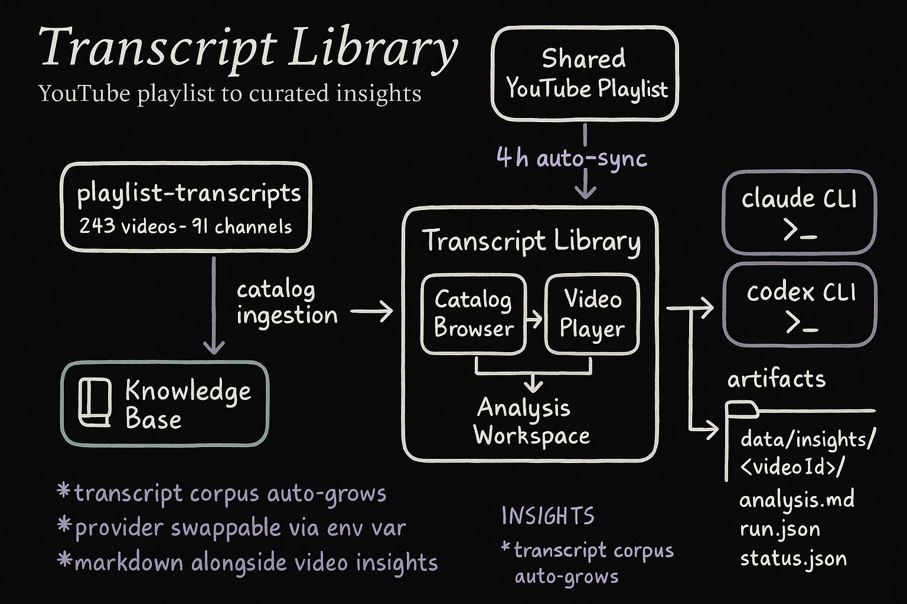

<div align="center">

# Transcript Library

### **Watch the source. Read the analysis. Keep the signal.**

[](LICENSE)
[](https://nextjs.org)
[](https://github.com/AojdevStudio/transcript-library/pulls)

*A private reading room for a small group of friends who take YouTube seriously.*

[**Library**](#quick-start) · [**Knowledge Base**](#how-it-works) · [**Analysis Runtime**](#how-it-works)

</div>

---

## The Problem With Shared Playlists

You drop a YouTube video in the group chat. Three friends say they'll watch it. One actually does, a week later, alone, and forgets what they wanted to say. The other two never get around to it.

The video had real signal. A framework you could apply. A story worth discussing. But the knowledge dissolved — into separate browser sessions, half-watched tabs, and messages that got buried.

- The insight lived in your head, not somewhere shareable
- There was no way to read the transcript without leaving the video
- Analysis you'd want to reference later didn't exist
- You watched it once and moved on

**Sound familiar?**

> *"I'll send you the timestamp." — said before forgetting the timestamp, the video, and what it was about.*

---

## The Insight

Everyone in the group is curious. Nobody has unlimited time. You need a way to extract signal from a video without treating it like a solo research project.

<div align="center">

### **Watch the video inside the app.**
### **Let the analysis run in the background.**

</div>

The transcript is already there. The AI tooling already exists. The only missing piece was a workspace that wired it together — for a specific group of people who already trust each other's taste in content.

<div align="center">

## **A reading room for your shared playlist.**

</div>

---

## What This Is

Transcript Library is a private internal tool for a small group of friends built around a shared YouTube playlist.

| Layer | What It Does |
|:------|:-------------|
| **Catalog** | Reads transcript metadata from a local `playlist-transcripts` repo |
| **Player** | Embeds the YouTube video in-app — no tab switching |
| **Analysis** | Runs AI synthesis headlessly via `claude` CLI or `codex` CLI |
| **Knowledge** | Stores markdown notes alongside video insights for long-term reference |

This is not a SaaS product. It is a proof of concept for a trusted group that already has access to Claude and ChatGPT tooling.

---

## See It In Action

<details>
<summary><b>The workspace: player + analysis on one page</b></summary>

```
Library > Channel > Video Title

[  YouTube player — full width, no chrome  ]

Analysis
──────────────────────────────────────────
Summary    Key Takeaways    Action Items

Full report ↓ (rendered inline, no disclosure)

Transcript
──────────────────────────────────────────
Part 1  ·  2,400 words         Open ↗
Part 2  ·  1,800 words         Open ↗
```

</details>

<details>
<summary><b>The pipeline: how a video becomes an insight</b></summary>

```
Shared YouTube Playlist
        ↓
playlist-transcripts repo (auto-syncs every 4h)
        ↓
Transcript Library catalog ingestion
        ↓
POST /api/analyze?videoId=...
        ↓
claude CLI or codex CLI (headless, local)
        ↓
data/insights/<videoId>/analysis.md
        ↓
VideoAnalysisWorkspace (live status, polling)
```

</details>

---

## What You Get

| Feature | How It Works | Why It Matters |
|:--------|:-------------|:---------------|
| **Embedded player** | YouTube iframe, no redirect | Watch and read without splitting attention |
| **Headless analysis** | claude-cli or codex-cli via provider abstraction | Run from any machine, swap providers without touching UI |
| **Insight artifacts** | Canonical `analysis.md` + run metadata per video | Stable lookup by `videoId`, human-readable alongside machine paths |
| **Live status** | SSE stream during analysis run | Know when it's done without refreshing |
| **Knowledge base** | Markdown folders alongside video insights | Essays and notes in the same editorial workspace |
| **Breadcrumb navigation** | Library → Channel → Video | Always know where you are, always one click back |

---

## Quick Start

### Prerequisites

- Node.js 18+ / [Bun](https://bun.sh)
- A local clone of your `playlist-transcripts` repo
- `claude` CLI or `codex` CLI (for running analysis)

### Install

```bash
git clone https://github.com/AojdevStudio/transcript-library
cd transcript-library
bun install
cp .env.example .env.local
```

### Configure

```bash
# Required
PLAYLIST_TRANSCRIPTS_REPO=/absolute/path/to/playlist-transcripts

# Optional — defaults to claude-cli
ANALYSIS_PROVIDER=claude-cli
```

### Run

```bash
just start
# → http://localhost:3939
```

---

## How It Works



### Artifact Layout

Each analysis lives under a stable `videoId` path:

```
data/insights/<videoId>/
  analysis.md              ← canonical output
  <slugified-title>.md     ← human-readable copy
  video-metadata.json      ← channel, topic, published date
  run.json                 ← provider, model, timing
  worker-stdout.txt        ← live log during run
  worker-stderr.txt        ← errors
  status.json              ← idle | running | complete | failed
```

### Provider Abstraction

Analysis runs through a thin provider boundary. Swap `ANALYSIS_PROVIDER` to switch between `claude-cli` and `codex-cli` — no UI changes, no redeployment.

```bash
# In .env.local
ANALYSIS_PROVIDER=claude-cli    # default
ANALYSIS_PROVIDER=codex-cli     # alternative
```

### Core API Routes

```
POST /api/analyze?videoId=...         Start headless analysis
GET  /api/analyze/status?videoId=...  Poll run status
GET  /api/insight?videoId=...         Fetch completed insight
GET  /api/insight/stream?videoId=...  SSE stream during run
GET  /api/raw?path=...                Serve raw transcript chunks
```

---

## Commands

```bash
just start            # Dev server
just prod-start       # Production
just build            # Next.js build
just lint             # ESLint
just typecheck        # tsc --noEmit
just backfill-insights  # Re-run analysis for existing videos
```

---

## The Story

This started as a frustration. Our group watches a lot of YouTube — not casually, but deliberately. We share links and say "this one is worth your time." But saying it and actually watching it together are different things.

The `playlist-transcripts` repo already existed — a cron job pulling transcript data for 243 videos across 91 channels. The AI tooling already existed. What didn't exist was a workspace that made the signal accessible without a separate workflow for every person in the group.

So this became a reading room. You pick a video, the player loads inline, the analysis runs in the background, and the transcript is there if you want the exact words. The knowledge base holds notes alongside the video insights. Everything is organized by the same `videoId` key, so nothing ever gets lost.

It's private, it's opinionated, and it's built for exactly one use case: a small group of friends who take ideas seriously.

<div align="center">

### The video is the source. The analysis is the shortcut. The discussion is the point.

</div>

---

## Docs

- [System overview](./docs/architecture/system-overview.md)
- [Analysis runtime](./docs/architecture/analysis-runtime.md)
- [Worker topology](./docs/architecture/worker-topology.md)
- [Artifact schema](./docs/architecture/artifact-schema.md)
- [Provider runbook](./docs/operations/provider-runbook.md)

---

<div align="center">

**Built for the group. Kept private. Worth sharing the idea.**

</div>
