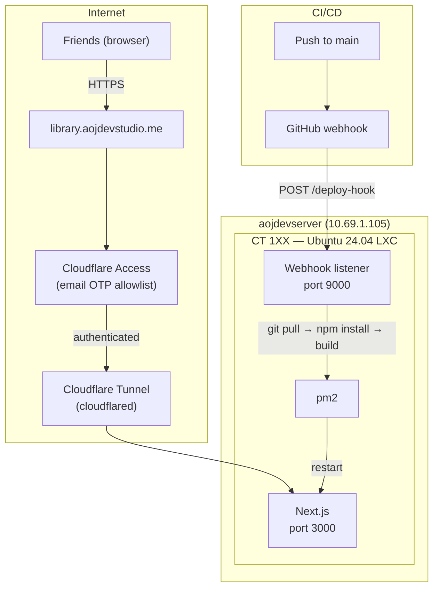

# Self-Hosted Deployment on Proxmox

**Date:** 2026-03-09
**Status:** Approved
**Scope:** Deploy Transcript Library on Proxmox with Cloudflare Tunnel, Access OTP, and webhook-based CI/CD

## Context

The Transcript Library is a Next.js app that spawns `claude` CLI as a child process for analysis and reads/writes to the local filesystem (35 fs calls across 13 files). This makes it incompatible with serverless platforms like Vercel. Self-hosting on Proxmox requires zero code changes and gives friends access via a custom domain.

## Architecture



## Decision Log

| Decision | Choice | Rationale |
|----------|--------|-----------|
| Hosting | Proxmox self-hosted | App requires local filesystem + CLI child processes |
| Auth | Cloudflare Access OTP | Zero code changes, free, email allowlist built-in |
| Container | New dedicated LXC | Isolation, easy snapshot/backup, clean environment |
| CI/CD | GitHub webhook auto-deploy | Push to main triggers deploy in ~30s |
| Process manager | pm2 | Auto-restart, log management, startup on boot |
| Tunnel | Cloudflare Tunnel | No port forwarding, no firewall holes, TLS by default |

## Components

### 1. LXC Container (CT 1XX on aojdevserver)

| Setting | Value |
|---------|-------|
| OS | Ubuntu 24.04 (unprivileged) |
| CPU | 2 cores |
| RAM | 2 GB |
| Disk | 16 GB (local-lvm) |
| Network | DHCP on vmbr0 (10.69.1.0/24) |
| Features | nesting |
| Autostart | yes |

**Software to install:**
- Node.js 22 (via nodesource or fnm)
- git
- yt-dlp (for metadata enrichment)
- cloudflared
- pm2 (global npm package)
- Claude CLI (`@anthropic-ai/claude-code`)

### 2. Cloudflare Tunnel

```yaml
# ~/.cloudflared/config.yml
tunnel: <tunnel-id>
credentials-file: /home/deploy/.cloudflared/<tunnel-id>.json

ingress:
  - hostname: library.aojdevstudio.me
    path: /deploy-hook
    service: http://localhost:9000
  - hostname: library.aojdevstudio.me
    service: http://localhost:3000
  - service: http_status:404
```

Setup steps:
1. `cloudflared tunnel login` — authenticates with CF account
2. `cloudflared tunnel create transcript-library` — creates tunnel + credentials JSON
3. `cloudflared tunnel route dns transcript-library library.aojdevstudio.me` — creates CNAME
4. Write config.yml with ingress rules
5. `cloudflared service install` — installs as systemd service

### 3. Cloudflare Access

- Zero Trust dashboard → Applications → Add self-hosted application
- Application domain: `library.aojdevstudio.me`
- Identity provider: One-time PIN (built-in, zero config)
- Policy: Allow → Emails → `[ossie@..., friend1@..., friend2@...]`
- Session duration: 24h (configurable)

Flow: friend visits URL → enters email → gets 6-digit code by email → enters code → authenticated

### 4. CI/CD — GitHub Webhook Auto-Deploy

**Webhook listener** on the LXC (port 9000):
- Receives POST from GitHub on push to `main`
- Verifies HMAC signature using shared secret
- Executes deploy script:
  1. `cd /opt/transcript-library && git pull origin main`
  2. `npm install`
  3. `npx next build --webpack`
  4. `pm2 restart transcript-library`
- Logs to `/var/log/transcript-library-deploy.log`

**GitHub repo settings:**
- Webhooks → Add webhook
- Payload URL: `https://library.aojdevstudio.me/deploy-hook`
- Content type: `application/json`
- Secret: shared HMAC secret
- Events: push events only
- Branch filter: `main` only (checked in the listener)

### 5. Transcript Data Sync

- Clone `playlist-transcripts` repo into `/opt/playlist-transcripts`
- Set env var: `PLAYLIST_TRANSCRIPTS_REPO=/opt/playlist-transcripts`
- Cron job: `0 * * * * cd /opt/playlist-transcripts && git pull` (hourly)

### 6. Process Management

```bash
# Start the app
cd /opt/transcript-library
pm2 start npm --name transcript-library -- run start

# Persist across reboots
pm2 save
pm2 startup
```

### 7. Environment Variables

```bash
# /opt/transcript-library/.env.local
PLAYLIST_TRANSCRIPTS_REPO=/opt/playlist-transcripts
ANALYSIS_PROVIDER=claude-cli
# Optional: ANTHROPIC_API_KEY as fallback if CLI session expires
# Optional: CLAUDE_ANALYSIS_MODEL=...
```

## Implementation Steps

### Phase 1 — LXC Setup
1. Create Ubuntu 24.04 LXC on aojdevserver (2 CPU, 2GB RAM, 16GB disk)
2. Install Node 22, git, yt-dlp, pm2
3. Create deploy user, clone transcript-library and playlist-transcripts repos
4. Set environment variables, run `npm install && npm run build`
5. Start app with pm2, verify it serves on port 3000 internally

### Phase 2 — Cloudflare Tunnel
6. Install cloudflared in the LXC
7. `cloudflared tunnel login`
8. `cloudflared tunnel create transcript-library`
9. `cloudflared tunnel route dns transcript-library library.aojdevstudio.me`
10. Write config.yml with ingress rules (deploy-hook + app)
11. `cloudflared service install` for systemd auto-start
12. Verify: access `library.aojdevstudio.me` from outside the LAN

### Phase 3 — Cloudflare Access
13. CF Zero Trust dashboard → Add Application (self-hosted)
14. Set domain to `library.aojdevstudio.me`
15. Enable One-time PIN identity provider
16. Create policy: Allow → Emails → friends' email list
17. Verify: visit URL → see OTP prompt → receive email code → access app

### Phase 4 — Claude CLI Auth
18. Install Claude CLI in LXC
19. `claude login` to authenticate
20. Test: trigger analysis from the UI, verify it spawns and completes

### Phase 5 — CI/CD
21. Write webhook listener script (Node, ~40 lines, HMAC verification)
22. Run listener on port 9000 via pm2
23. Add ingress rule for `/deploy-hook` in cloudflared config
24. Add webhook in GitHub repo settings (URL, secret, push events)
25. Verify: push to main → webhook fires → LXC pulls + builds + restarts

### Phase 6 — Hardening
26. Set up transcript repo sync cron (hourly git pull)
27. Set up pm2 log rotation
28. Test LXC reboot → verify autostart (cloudflared + pm2 + app all come back)
29. Snapshot the LXC as a known-good baseline

## Pre-Deploy Fixes (required before Phase 1)

These codebase issues must be resolved before deployment:

### ~~Fix 1: Remove hardcoded Mac fallback path~~ DONE
`src/app/api/raw/route.ts` — removed Mac fallback, now returns 503 if `PLAYLIST_TRANSCRIPTS_REPO` is unset.

### Fix 2: Add `output: 'standalone'` to next.config.ts
Without this, pm2 needs the full `node_modules` at runtime. With `standalone`, Next.js produces a self-contained `.next/standalone` directory — faster deploys, smaller footprint.

### Fix 3: Use `--webpack` flag in build
The justfile uses `bunx next build --webpack` to avoid Next.js 16 Turbopack issues. The deploy script should match: `npx next build --webpack` instead of `npm run build`.

### Fix 4: Exclude deploy-hook from Cloudflare Access
The `/deploy-hook` path shares the same hostname as the app. Cloudflare Access will gate it behind OTP — but GitHub's webhook sender can't authenticate. Options:
- **Bypass rule**: In the Access Application, add a bypass policy for path `/deploy-hook` (Access supports path-based policies)
- **Service token**: Create a CF Service Token and configure GitHub webhook to send it as a header (more secure but more complex)

## Risks and Mitigations

| Risk | Mitigation |
|------|------------|
| Claude CLI session expires | Set `ANTHROPIC_API_KEY` env var as fallback |
| LXC goes down | Proxmox autostart + monitoring |
| Webhook abuse | HMAC signature verification, branch filter |
| Build OOM | 2GB RAM is sufficient for Next.js; bump if needed |
| Transcript repo drift | Hourly cron sync; can increase frequency |
| Cloudflared crashes | systemd auto-restart via service unit |
| Deploy-hook blocked by Access OTP | Bypass policy for `/deploy-hook` path |
| Turbopack build failures on Linux | Use `--webpack` flag in build command |

## Cost

Zero additional cost. Cloudflare free tier (tunnel + access + DNS). Proxmox hardware already owned.
