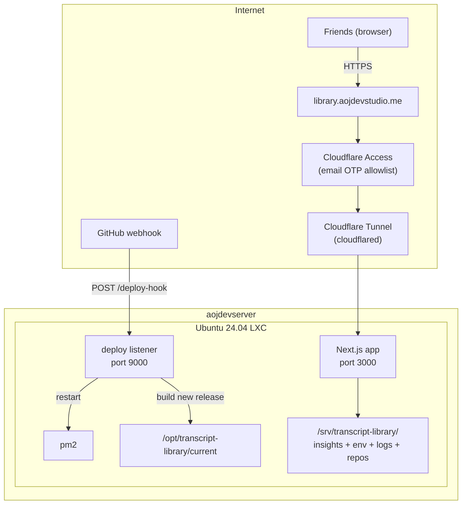

# Self-Hosted Deployment on Proxmox

**Date:** 2026-03-09
**Status:** Revised
**Scope:** Deploy Transcript Library on Proxmox with Cloudflare Tunnel, Cloudflare Access OTP, and safe webhook-based CI/CD

## Verdict

This is a good deployment direction for this app.

For unattended operations, the command to schedule is `node --import tsx scripts/daily-operational-sweep.ts`.
That daily sweep is refresh-only with conservative repair: it refreshes the local transcript checkout,
rebuilds browse state, repairs only already-approved safe historical mismatches, writes durable sweep
artifacts, and leaves rerun-only videos in manual follow-up instead of auto-starting analysis.

The core adjustment is simple but important:

- do **not** run production from a git worktree that also stores mutable analysis artifacts
- do **not** let deploys depend on `git pull` inside that mutable runtime directory

With that correction, this becomes a strong low-cost plan.

## Context

Transcript Library is a Next.js app that:

- reads transcript files from `PLAYLIST_TRANSCRIPTS_REPO`
- spawns local CLI providers for analysis
- writes `analysis.json`, `analysis.md`, `run.json`, `status.json`, and worker logs to disk

That makes self-hosting a better fit than serverless hosting. Proxmox + Cloudflare Tunnel + Cloudflare Access fits the app well and keeps cost low.

## Architecture



## Decision Log

| Decision        | Choice                                      | Rationale                                                     |
| --------------- | ------------------------------------------- | ------------------------------------------------------------- |
| Hosting         | Proxmox self-hosted                         | Filesystem writes + CLI child processes are first-class needs |
| Auth            | Cloudflare Access OTP                       | No app auth work required, easy friend allowlist              |
| Container       | Dedicated LXC                               | Clean isolation, snapshots, easy rollback                     |
| Deploy style    | Immutable release dir + shared runtime data | Avoid repo dirtiness and `git pull` conflicts                 |
| Process manager | pm2                                         | Simple restarts, logs, startup on boot                        |
| Tunnel          | Cloudflare Tunnel                           | No port forwarding, TLS by default                            |
| Webhook ingress | Separate hostname                           | Cleaner than path bypass under Access                         |

## Key Design Rule

Separate these three things:

1. **App release code**
   Path example: `/opt/transcript-library/releases/<timestamp-or-sha>/`

2. **Current symlink**
   Path example: `/opt/transcript-library/current`

3. **Mutable runtime data**
   Path example: `/srv/transcript-library/`

Runtime data should include:

- `insights/`
- `logs/`
- `.env.local`
- `playlist-transcripts/`
- Claude auth state if needed for the runtime user

This avoids deploy failures caused by the app writing to tracked files under `data/insights`.

## Pre-Infra Gate

Do not start infrastructure setup until the insight-storage refactor is complete.

This app currently hardcodes insight storage under the app working tree. The deployment design in this document assumes configurable runtime storage, so that refactor is a real prerequisite, not a note to remember later.

Implementation plan:

- [Structured Insight Storage Path Implementation Plan](/Users/ossieirondi/Projects/transcript-library/docs/plans/2026-03-09-configurable-insights-base-dir.md)

Migration gate:

- run `node scripts/migrate-legacy-insights-to-json.ts --check`
- do not treat the migration window as complete until `/srv/transcript-library/insights/.migration-status.json`
  reports `remainingLegacyCount: 0`

Infra work should begin only after that plan is implemented and verified on a branch.

## Components

### 1. LXC Container

| Setting   | Value                       |
| --------- | --------------------------- |
| OS        | Ubuntu 24.04 LXC            |
| CPU       | 2 cores                     |
| RAM       | 2 GB to start               |
| Disk      | 24 GB preferred             |
| Network   | DHCP or reserved DHCP lease |
| Autostart | yes                         |

Install:

- Node.js 22
- git
- yt-dlp
- cloudflared
- pm2
- Claude CLI

### 2. Directory Layout

```text
/opt/transcript-library/
  releases/
    2026-03-09T220000Z/
    2026-03-10T010000Z/
  current -> /opt/transcript-library/releases/2026-03-10T010000Z

/srv/transcript-library/
  insights/
  logs/
  playlist-transcripts/
  .env.local
```

### 3. App Runtime

Run the app from `/opt/transcript-library/current`.

Point mutable state to `/srv/transcript-library`:

- `PLAYLIST_TRANSCRIPTS_REPO=/srv/transcript-library/playlist-transcripts`
- `INSIGHTS_BASE_DIR=/srv/transcript-library/insights`
- `CATALOG_DB_PATH=/srv/transcript-library/catalog/catalog.db`

Hosted startup should treat `/srv/transcript-library/playlist-transcripts` as the app-owned local git checkout for refresh-only source sync. The app should not assume directory existence alone means freshness; it should refresh through the supported entrypoints and inspect the resulting evidence files.

### 4. Cloudflare Tunnel

Use two hostnames:

- `library.aojdevstudio.me` -> app on port 3000
- `library-deploy.aojdevstudio.me` -> webhook listener on port 9000

That is cleaner than sharing one hostname and then bypassing Access for one path.

Example config:

```yaml
tunnel: <tunnel-id>
credentials-file: /home/deploy/.cloudflared/<tunnel-id>.json

ingress:
  - hostname: library.aojdevstudio.me
    service: http://localhost:3000
  - hostname: library-deploy.aojdevstudio.me
    service: http://localhost:9000
  - service: http_status:404
```

### 5. Cloudflare Access

Protect only the friend-facing app hostname:

- application: `library.aojdevstudio.me`
- identity provider: One-time PIN
- policy: allowlisted emails only

This hostname is for **browser access** by approved friends. The browser reaches app routes through Cloudflare-managed identity; it should not be given `PRIVATE_API_TOKEN`, `SYNC_TOKEN`, or any other app-managed secret.

At the origin, hosted browser trust depends on the Cloudflare Access request shape (`cf-access-jwt-assertion` + authenticated email headers) plus `CLOUDFLARE_ACCESS_AUD` configured on the app.

Do **not** put OTP in front of the GitHub webhook endpoint.

For `library-deploy.aojdevstudio.me`, rely on:

- GitHub webhook secret signature verification
- optional IP allowlisting if you want extra filtering
- Cloudflare service-token protection if you later want edge-authenticated deploy automation without reusing the friend-facing browser flow

### 6. CI/CD

Deploy flow:

1. GitHub sends webhook to `https://library-deploy.aojdevstudio.me/deploy-hook`
2. Listener verifies HMAC signature
3. Listener clones repo or fetches a clean copy into a new release dir
4. Listener installs dependencies with `npm ci`
5. Listener builds with `npx next build --webpack`
6. Listener atomically repoints `/opt/transcript-library/current`
7. Listener restarts pm2 process
8. Listener keeps prior release for rollback

Do not use `git pull` inside the live runtime directory.

### 7. Transcript Sync

Clone transcript data into:

- `/srv/transcript-library/playlist-transcripts`

For unattended operation, schedule the daily sweep rather than a bare `git pull` cron:

```bash
cd /opt/transcript-library/current
node --import tsx scripts/daily-operational-sweep.ts
```

That unattended command runs the app-owned refresh contract first, then the conservative repair pass, and writes durable operator evidence. If you need refresh without the repair layer, use the narrower refresh entrypoints:

```bash
cd /opt/transcript-library/current
node --import tsx scripts/refresh-source-catalog.ts
```

or, for machine callers:

```http
POST /api/sync-hook
Authorization: Bearer <SYNC_TOKEN>
```

Topology note:

- Do **not** model `library.aojdevstudio.me` as a generic bearer-auth hostname.
- Browser traffic on that hostname is the friend-facing Cloudflare Access flow.
- If an external automation caller must cross the Cloudflare edge to reach `/api/sync-hook`, give it a Cloudflare service token or route it through a dedicated automation hostname rather than expecting bearer-only access on the friend-facing hostname.

Inspect after each unattended sweep with:

```bash
cat /srv/transcript-library/catalog/last-source-refresh.json
cat /srv/transcript-library/catalog/last-import-validation.json
cat /srv/transcript-library/runtime/daily-operational-sweep/latest.json
```

Those files live next to `CATALOG_DB_PATH` or `INSIGHTS_BASE_DIR`, so keep the catalog and runtime storage on shared storage rather than inside the release tree.

If the sweep artifact reports `manualFollowUpVideoIds`, those are rerun-only videos that need explicit operator follow-up. This is deliberately refresh-only at the ingest boundary: new videos become browsable after refresh, while analysis remains on-demand or part of an explicit workflow.

### 8. Process Management

Use pm2 against the current release:

```bash
cd /opt/transcript-library/current
pm2 start npm --name transcript-library -- run start
pm2 save
pm2 startup
```

If you later switch to standalone output, update the run command to the standalone server directly. Until then, keep the deployment model simple and consistent.

### 9. Environment Variables

```bash
# /srv/transcript-library/.env.local
HOSTED=true
PLAYLIST_TRANSCRIPTS_REPO=/srv/transcript-library/playlist-transcripts
PLAYLIST_TRANSCRIPTS_BRANCH=master
CATALOG_DB_PATH=/srv/transcript-library/catalog/catalog.db
INSIGHTS_BASE_DIR=/srv/transcript-library/insights
CLOUDFLARE_ACCESS_AUD=<cloudflare-access-audience>
PRIVATE_API_TOKEN=<strong-random-token>
SYNC_TOKEN=<strong-random-token>
ANALYSIS_PROVIDER=claude-cli
```

Optional:

- `PLAYLIST_TRANSCRIPTS_REMOTE=origin`
- `CLAUDE_ANALYSIS_MODEL=...`
- `ANTHROPIC_API_KEY=...`

Important note:

- `ANTHROPIC_API_KEY` is not a free safety net
- it is a separate billed API path, not the same thing as staying logged into the Claude CLI

## Implementation Steps

### Phase 1 - App prep

1. Complete the prerequisite plan for configurable insight storage:
   `docs/plans/2026-03-09-configurable-insights-base-dir.md`
2. Verify app works with:
   `INSIGHTS_BASE_DIR=/srv/transcript-library/insights`
3. Confirm runtime writes no longer land inside the release tree
4. Confirm new runs write `analysis.json` plus derived `analysis.md`
5. Run `node scripts/migrate-legacy-insights-to-json.ts --check`
6. If needed, run `node scripts/migrate-legacy-insights-to-json.ts`
7. Confirm `.migration-status.json` reports `remainingLegacyCount: 0`

### Phase 2 - LXC setup

8. Create Ubuntu 24.04 LXC
9. Install Node 22, git, yt-dlp, pm2, cloudflared, Claude CLI
10. Create runtime directories under `/opt/transcript-library` and `/srv/transcript-library`
11. Clone `playlist-transcripts` into `/srv/transcript-library/playlist-transcripts`
12. Add `/srv/transcript-library/.env.local`
13. Verify hosted preflight can inspect the checkout as a git repo and that `PLAYLIST_TRANSCRIPTS_BRANCH`, `PRIVATE_API_TOKEN`, and `SYNC_TOKEN` are set for unattended use

### Phase 3 - First release

14. Create first release directory from a clean clone
15. Run `npm ci`
16. Run `npx next build --webpack`
17. Point `current` symlink at the new release
18. Start pm2 app from `/opt/transcript-library/current`
19. Verify app on `http://localhost:3000`
20. Run `node --import tsx scripts/daily-operational-sweep.ts` from the current release and confirm `last-source-refresh.json`, `last-import-validation.json`, and `runtime/daily-operational-sweep/latest.json` exist where the hosted runtime expects them

### Phase 4 - Tunnel and Access

16. Create Cloudflare Tunnel
17. Route DNS for:
    `library.aojdevstudio.me`
18. Route DNS for:
    `library-deploy.aojdevstudio.me`
19. Install and enable cloudflared service
20. Add Cloudflare Access OTP for `library.aojdevstudio.me`
21. Verify friend login flow

### Phase 5 - Claude runtime auth

25. Authenticate Claude CLI as the same Linux user that runs pm2
26. Trigger analysis from the UI
27. Verify `analysis.json`, `analysis.md`, `run.json`, `status.json`, and logs are created under `/srv/transcript-library/insights`
28. Verify `/srv/transcript-library/insights/.migration-status.json` exists after running the migration check

### Phase 6 - Webhook deploy

25. Write deploy listener
26. Verify HMAC signature
27. Build to a new release dir using `npm ci`
28. Repoint `current`
29. Restart pm2
30. Keep previous release for rollback

### Phase 7 - Hardening

31. Add pm2 log rotation
32. Add a daily sweep cron or systemd timer that runs `node --import tsx scripts/daily-operational-sweep.ts`
33. After each unattended run, inspect `/srv/transcript-library/runtime/daily-operational-sweep/latest.json` and confirm whether `manualFollowUpVideoIds` is empty or names rerun-only videos that need explicit operator follow-up
34. Test `POST /api/sync-hook` with `SYNC_TOKEN`
35. Test LXC reboot
36. Test rollback to previous release
37. Snapshot the LXC

## Pre-Deploy Code Changes

### Required

1. Make insight storage path configurable
   This is now scoped in:
   `docs/plans/2026-03-09-configurable-insights-base-dir.md`

2. Make the JSON-first artifact model operational
   This includes the one-time legacy migration and `.migration-status.json` completion signal.

3. Keep deploy code and runtime data separate
   This is the key deployment safety fix.

4. Use `npm ci` instead of `npm install` in unattended deploys

5. Keep `--webpack` in the build command

### Optional

1. Add `output: "standalone"` to `next.config.ts`
   Only do this if you also switch the runtime command to the standalone server output.

2. Add a worker/service split once local CLI execution moves off the web runtime

## Risks and Mitigations

| Risk                           | Mitigation                                                                                                                                                                                                                        |
| ------------------------------ | --------------------------------------------------------------------------------------------------------------------------------------------------------------------------------------------------------------------------------- |
| Production repo becomes dirty  | Never run production from a mutable git worktree                                                                                                                                                                                  |
| Deploy fails during pull/build | Build fresh release directory, then swap symlink                                                                                                                                                                                  |
| Claude CLI login expires       | Re-auth the runtime user; API key is optional but billable                                                                                                                                                                        |
| Build OOM                      | Start with 2 GB, bump if Linux build proves tight                                                                                                                                                                                 |
| Transcript repo drift          | Schedule the daily sweep `scripts/daily-operational-sweep.ts` or trigger refresh with `POST /api/sync-hook`; inspect `last-source-refresh.json`, `last-import-validation.json`, and `runtime/daily-operational-sweep/latest.json` |
| Rerun-only drift is hidden     | Treat non-empty `manualFollowUpVideoIds` in the daily sweep artifact as manual follow-up; analysis remains on-demand and requires an explicit rerun workflow                                                                      |
| Webhook abuse                  | HMAC verification, dedicated deploy hostname                                                                                                                                                                                      |
| Access blocks webhook          | Keep deploy hostname outside OTP Access app                                                                                                                                                                                       |
| Rollback is painful            | Keep previous release directory and repoint symlink                                                                                                                                                                               |

## Cost

Baseline hosting cost:

- Proxmox hardware already owned
- Cloudflare Tunnel + DNS + Access can stay near-zero on the free tier

Possible non-zero cost:

- Anthropic API usage, if you choose `ANTHROPIC_API_KEY` fallback

## Recommended Domain Names

Primary app:

- `library.aojdevstudio.me`
- `readingroom.aojdevstudio.me`

Deploy hook:

- `library-deploy.aojdevstudio.me`
- `readingroom-deploy.aojdevstudio.me`

My recommendation:

- app: `library.aojdevstudio.me`
- deploy: `library-deploy.aojdevstudio.me`
