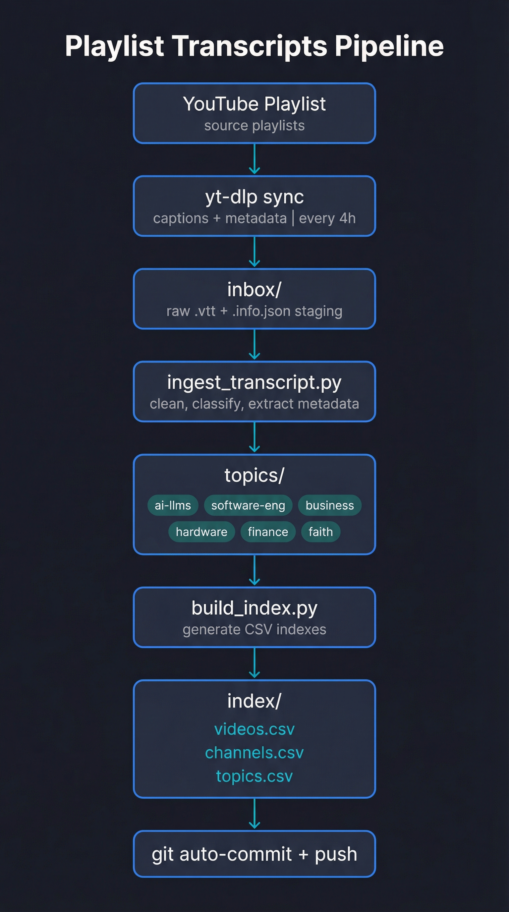

<div align="center">

# Playlist Transcripts

### **Stop re-watching videos. Start searching them.**

[](LICENSE)
<!-- BADGES:START -->
[]()
[]()
[]()
<!-- BADGES:END -->
[]()

*An autonomous system that turns a YouTube playlist into a classified, searchable, RAG-ready transcript vault.*

[**How It Works**](#how-it-works) · [**Quick Start**](#quick-start) · [**Topics**](#whats-inside)

</div>

---

## The Problem

You watch a YouTube video. There's a brilliant explanation of RAG pipelines at minute 23. Two weeks later, you need it. But which video was it? You open YouTube, scroll through your history, scrub through three different videos, and eventually give up.

YouTube is an incredible knowledge source trapped inside the worst retrieval format: video.

- **Can't search** inside video transcripts on YouTube
- **Can't organize** videos by actual content topic
- **Can't feed** video knowledge to your AI tools or RAG pipelines
- **Can't skim** — you either re-watch or lose the insight forever

> *"I know I watched a video about this... but which one?"*

**Sound familiar?**

---

## The Insight

<div align="center">

### **YouTube videos are just text**
### **waiting to be freed.**

</div>

Every video already has a transcript. The information is *there* — it's just locked behind a play button and buried in auto-generated captions nobody reads.

What if a system could automatically extract those transcripts, clean them up, classify them by topic, and organize them into a searchable vault that your AI tools can actually use?

<div align="center">

### **One playlist in. An organized knowledge base out.**

</div>

---

## Introducing Playlist Transcripts

A fully automated pipeline — codenamed **Jarvis** — that syncs a YouTube playlist every 4 hours, extracts transcripts, classifies them by topic using keyword analysis, and organizes everything into a structured, RAG-ready vault with complete metadata.

| Component | Role |
|:----------|:-----|
| **yt-dlp** | Pulls captions + metadata from YouTube |
| **Ingest Pipeline** | Cleans VTT artifacts, extracts metadata, writes YAML frontmatter |
| **Topic Classifier** | Routes transcripts to topics using keyword scoring against topic definitions |
| **Index Builder** | Generates CSV indexes for fast machine retrieval |
| **QA Checker** | 6-suite validation: structure, metadata, topics, channels, indexes, RAG readiness |

<p align="center">
  
</p>

---

## What's Inside

<!-- STATS:START -->
The vault currently holds **244 transcripts** from **91 channels** across **6 topics**:

| Topic | Transcripts | Channels | What's Covered |
|:------|:-----------:|:--------:|:---------------|
| **ai-llms** | 152 | 57 | Large language models, AI agents, prompt engineering, RAG, model tooling, and agent workflows |
| **software-engineering** | 43 | 16 | Software development practices, architecture, dev tooling, coding workflows, and engineering operations |
| **business** | 24 | 15 | Company building, operations, management, hiring, leadership, and strategy |
| **finance-investing** | 15 | 6 | Investing, markets, valuation, personal finance stacks, and financial strategy |
| **hardware-homelab** | 7 | 6 | Hardware builds, servers, homelab, local infrastructure |
| **faith** | 3 | 3 | Religious teaching, sermons, faith‑based content |
<!-- STATS:END -->

Each topic is defined with **scope**, **exclusions**, and **keywords** in its own `README.md` — the classifier reads these definitions to make routing decisions.

### Example Transcript

Every transcript is a Markdown file with complete YAML frontmatter:

```yaml
---
video_id: "VqDs46A8pqE"
title: "Claude Code is Amazing... Until It DELETES Production"
channel: "IndyDevDan"
topic: "ai-llms"
published_date: "2026-01-31"
ingested_date: "2026-01-31"
source: "youtube"
youtube_url: "https://youtube.com/watch?v=VqDs46A8pqE"
word_count: 4708
---
It's 7:30 in the morning and you're a hotshot agentic engineer...
```

---

## See It In Action

<details>
<summary><b>Demo: Full sync cycle (playlist to organized vault)</b></summary>

```bash
# 1. Jarvis pulls new videos from the playlist
$ ./sync_playlist.sh

# 2. yt-dlp downloads captions + metadata to inbox/
[download] Downloading item 1 of 2
[info] Writing video subtitles: inbox/VqDs46A8pqE.en.vtt
[info] Writing video metadata: inbox/VqDs46A8pqE.info.json

# 3. Ingest pipeline classifies and files each transcript
Processing VqDs46A8pqE...
  → Topic: ai-llms (score: 0.82)
  → Channel: IndyDevDan
  → Filed: topics/ai-llms/IndyDevDan/2026-01-31_claude-code-is-amazing...md

# 4. Indexes rebuilt
Building videos.csv... 30 entries
Building channels.csv... 25 entries
Building topics.csv... 6 entries

# 5. Auto-commit + push
[main abc1234] Update playlist transcripts 2026-02-01 08:00
```

</details>

---

## Built for RAG

The vault is designed to plug directly into AI retrieval pipelines:

| Feature | What It Does | Why It Matters |
|:--------|:-------------|:---------------|
| **YAML Frontmatter** | Structured metadata on every transcript | Filter by topic, channel, date before embedding |
| **CSV Indexes** | `videos.csv`, `channels.csv`, `topics.csv` | Fast lookup without parsing 30+ Markdown files |
| **Topic Organization** | Content grouped by domain | Scope retrieval to relevant knowledge areas |
| **Clean Text** | VTT artifacts stripped, whitespace normalized | Embeddings on clean prose, not caption markup |
| **Word Counts** | Pre-computed in frontmatter | Estimate token costs, identify chunking needs |
| **Deduplication** | One canonical file per video_id | No duplicate embeddings polluting your index |

### RAG Integration Example

```python
import csv

# Load the index
with open("youtube-transcripts/index/videos.csv") as f:
    videos = list(csv.DictReader(f))

# Filter to AI topics only
ai_videos = [v for v in videos if v["topic"] == "ai-llms"]

# Read transcripts for embedding
for video in ai_videos:
    with open(video["file_path"]) as f:
        content = f.read()
        # Strip YAML frontmatter
        body = content.split("---", 2)[2]
        # → Send to your embedding pipeline
```

---

## Quick Start

### Prerequisites

- Python 3.8+
- [yt-dlp](https://github.com/yt-dlp/yt-dlp) installed (`brew install yt-dlp` or `pip install yt-dlp`)
- Git

### Clone

```bash
git clone https://github.com/AojdevStudio/playlist-transcripts.git
cd playlist-transcripts
```

### Run a Sync

```bash
# Edit sync_playlist.sh to point REPO= to your clone path
# Then run:
./sync_playlist.sh
```

### Run QA Checks

```bash
python3 youtube-transcripts/scripts/run_repo_checks.py
```

The QA suite validates: directory structure, metadata completeness, topic distribution health, channel resolution, index accuracy, and RAG readiness.

---

## How It Works

### The Sync Pipeline

1. **Download** — `yt-dlp` pulls `.en.vtt` captions and `.info.json` metadata for any new videos in the playlist (tracked via archive file to skip re-downloads)

2. **Ingest** — `ingest_transcript.py` processes each inbox file:
   - Strips VTT timing cues and inline tags (`<00:12:34.567><c> word</c>`)
   - Extracts title, channel, dates from `.info.json`
   - Normalizes filenames: `YYYY-MM-DD_slugified-title.md` (80-char limit)
   - Writes structured YAML frontmatter + clean transcript body

3. **Classify** — `classify_topic.py` scores each transcript against topic keyword definitions:
   - Each `topics/{name}/README.md` defines scope + keywords
   - Transcript text is scanned for keyword frequency
   - Highest-scoring topic wins; ties go to the first match
   - Classification logged to `classification_log.csv`

4. **Index** — `build_index.py` walks all `topics/` directories and generates fresh CSV indexes from frontmatter

5. **Commit** — If changes detected, auto-commits and pushes

### Topic Classifier

Topics are self-describing. Each has a `README.md` with keywords:

```markdown
# ai-llms

**Scope:** Large language models, AI agents, prompt engineering, RAG, model tooling.
**Exclusions:** Pure finance, business ops unrelated to AI.
**Keywords:** llm, agent, prompt, rag, embedding, vector, claude, openai, anthropic, gpt
```

The classifier reads these definitions, scores transcript content against each keyword list, and routes accordingly.

### Quality Assurance

The built-in QA suite (`run_repo_checks.py`) runs 6 validation suites:

| Suite | What It Checks |
|:------|:---------------|
| **Structure** | Expected directories exist, no orphan files |
| **Metadata** | All transcripts have required frontmatter fields |
| **Topic Quality** | No single topic > 70% of total (drift detection) |
| **Channel Resolution** | No "unknown" channel concentration |
| **Index Accuracy** | CSVs match actual filesystem state |
| **RAG Readiness** | Files < 200KB, word counts present, no chunking gaps |

---

## The Story Behind This

I watch a lot of YouTube — AI tutorials, engineering talks, business podcasts, homelab guides. At some point I realized I was *re-watching* videos just to find a specific explanation I half-remembered. My browser history was useless. YouTube's search only finds videos, not moments within them.

So I built Jarvis — a background agent on my Mac Mini that syncs a curated playlist every few hours, pulls the transcripts, classifies them by what they're actually *about*, and files them into a structured vault. Now when I think "that video about RAG pipelines," I `grep` for it. When I need context for my AI tools, I point them at the CSV index.

The playlist is the input. The organized, searchable, RAG-ready vault is the output. Jarvis just keeps it growing.

<div align="center">

### Every video you watch contains knowledge worth keeping. This system keeps it for you.

</div>

---

## Roadmap

- [x] Automated transcript ingestion from YouTube playlists
- [x] Keyword-based topic classification with confidence scoring
- [x] CSV index generation for RAG pipelines
- [x] 6-suite QA validation
- [x] YAML frontmatter with complete metadata
- [ ] `SUMMARY.md` auto-generation for human-readable sync reports
- [ ] Fix `classification_log.csv` title resolution (rebuild from frontmatter)
- [ ] Multi-playlist support
- [ ] Transcript chunking for long videos (>200KB)
- [ ] Embedding generation pipeline integration

## Contributing

This is a personal knowledge management tool, but if you want to adapt it for your own playlist:

1. Fork the repo
2. Update `sync_playlist.sh` with your playlist URL and paths
3. Customize `topics/` — add your own topic directories with `README.md` keyword definitions
4. Run `./sync_playlist.sh`

## License

MIT

---

<div align="center">

**Stop re-watching. Start searching.**

If this approach resonates with you, [star the repo](https://github.com/AojdevStudio/playlist-transcripts) to follow along.

[](https://star-history.com/#AojdevStudio/playlist-transcripts&Date)

*Built by [@AojdevStudio](https://github.com/AojdevStudio) — powered by Jarvis*

</div>
